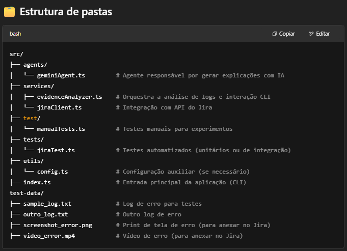

# 🤖 QA AI Agent - Análise Inteligente de Logs com Gemini

Este projeto é uma POC (Prova de Conceito) de um agente de IA para análise automatizada de logs de erro, com integração ao Jira. O agente utiliza a API Gemini (Google AI) para gerar explicações didáticas e técnicas sobre falhas capturadas em testes automatizados.

> 🔍 Projeto alinhado com a arquitetura de testes inteligentes definida pela equipe de QA e arquitetura da Trademaster.

---

## ✅ Funcionalidades já implementadas

- 📄 Leitura de múltiplos arquivos de log (`.txt`)
- 🧠 Geração de explicações automatizadas com IA (Gemini)
- 💬 Interface via CLI com perguntas interativas ao usuário
- 🔌 Integração com Jira para:
  - Comentar automaticamente em tickets
  - Anexar arquivos de log, prints e vídeos
- 🧪 Estrutura modular em TypeScript, pronta para CI/CD
- 🧰 Testes manuais e unitários com `test/` e `tests/`

---

## 🚀 Como executar localmente

1. Instale as dependências:

```bash
yarn install



